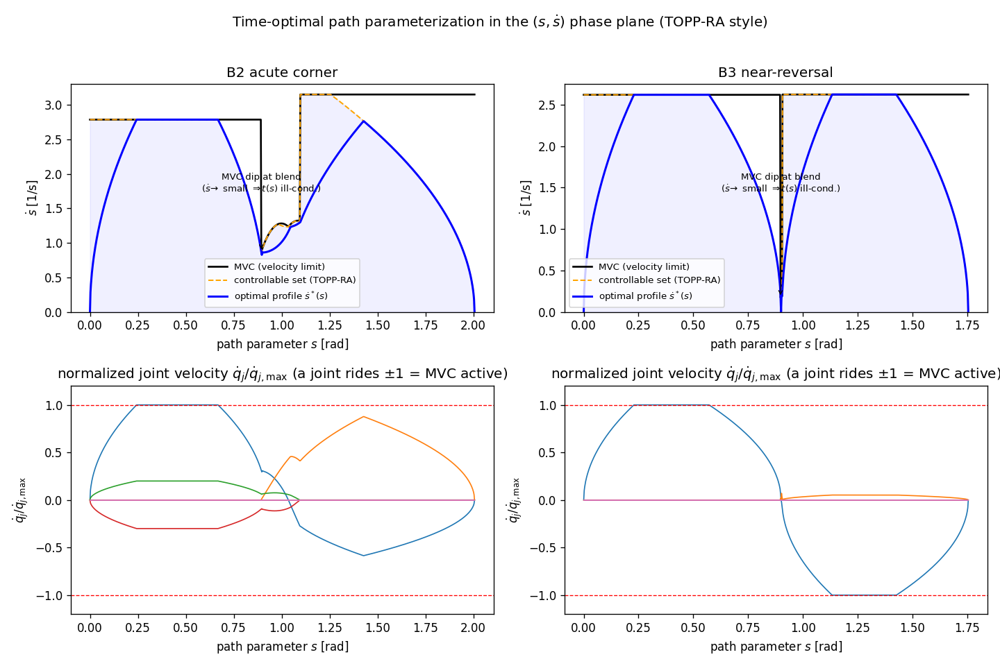
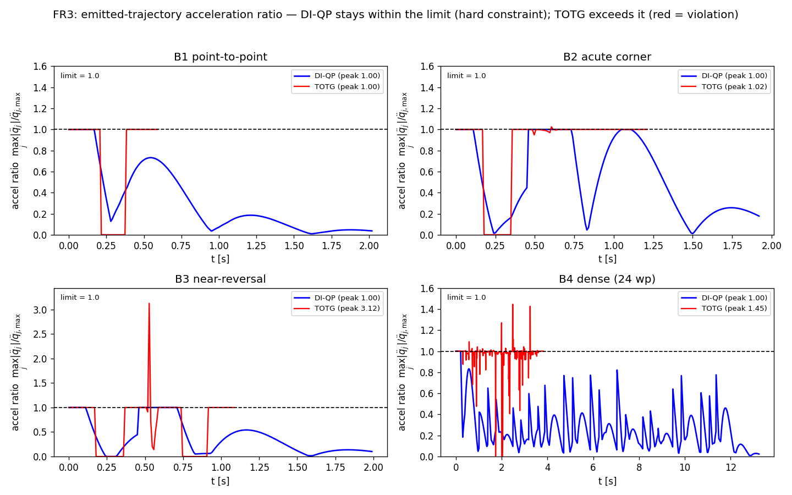
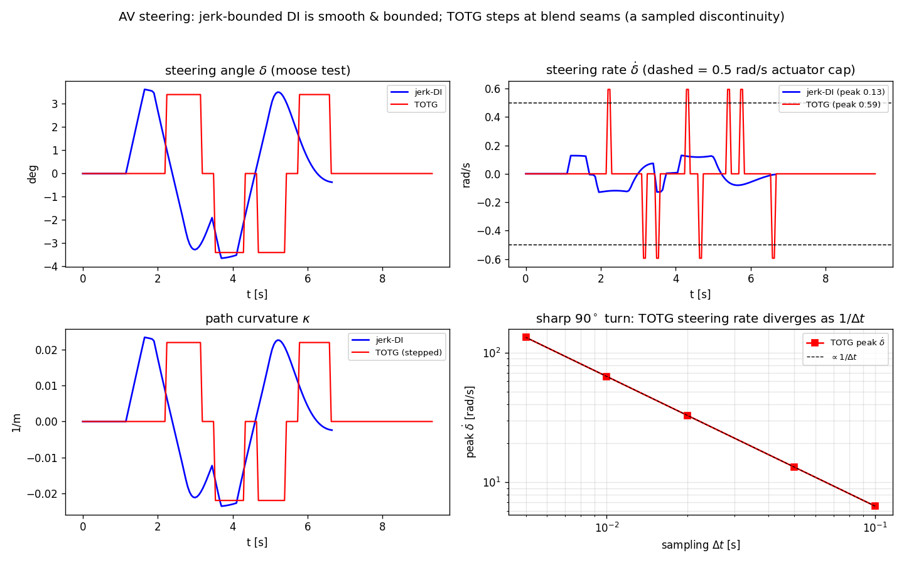
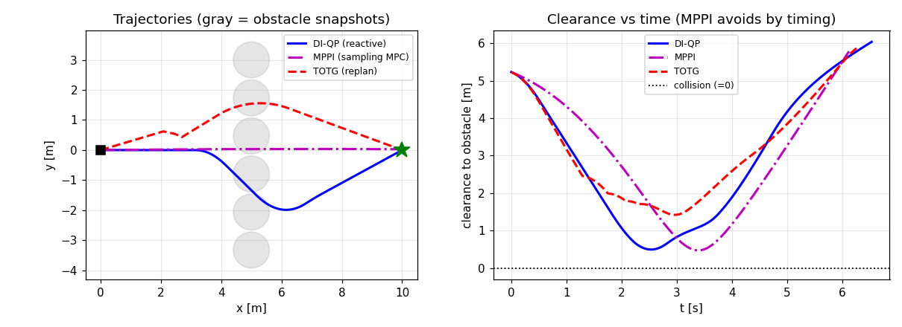
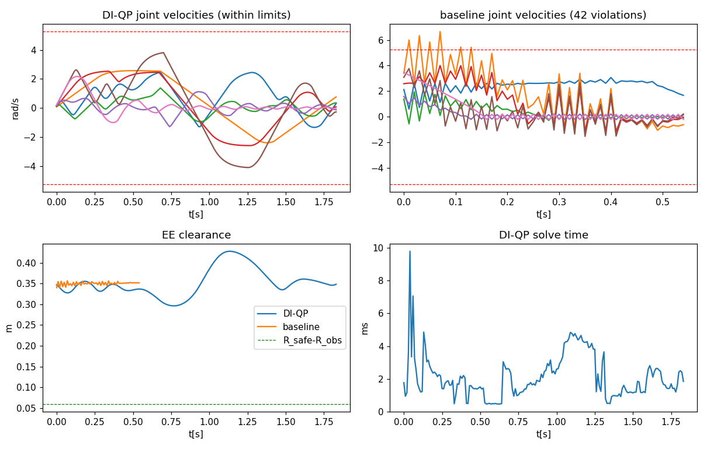
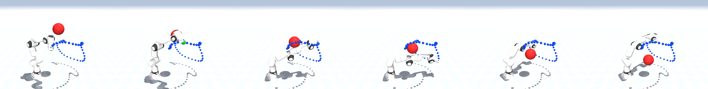
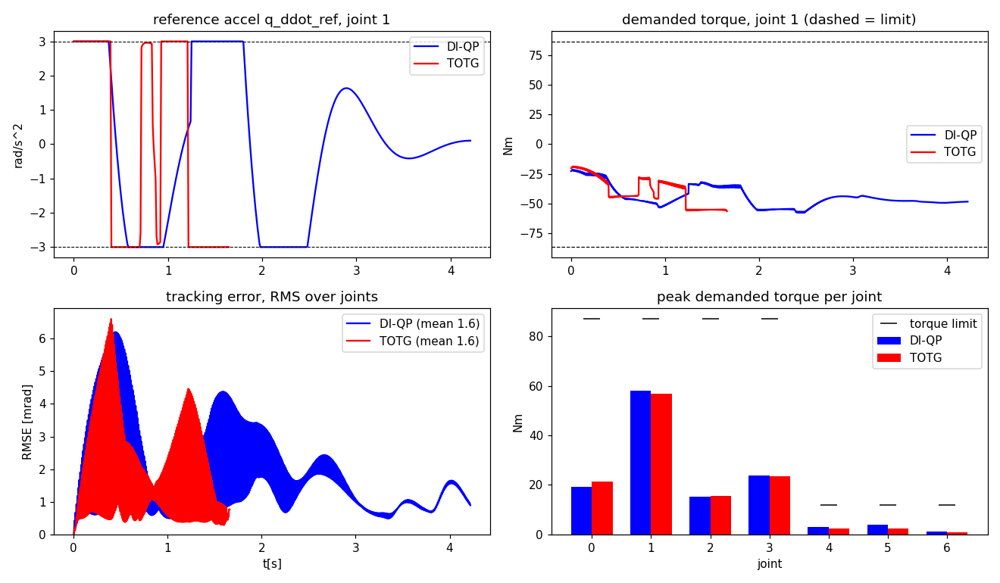

# Unified Predictive Motion Planning via a Constant State-Transition Double-Integrator Backbone

---

## Abstract

Traditional robotic motion planning separates geometric path-finding from temporal parameterization, limiting a robot's ability to react to dynamic obstacles without costly replanning loops. This paper presents a unified, real-time Predictive Motion Planner formulated directly in the time domain. Building on a two-layer architecture previously demonstrated for physical human–robot interaction (pHRI) compliance, Layer 1 maps the multi-variable joint space into a set of decoupled, configuration-independent virtual double integrators. Layer 2 solves a highly efficient convex Quadratic Program (QP) at 100 Hz or higher. By exploiting a completely constant state-transition matrix $A_d$, trajectory rollouts are precomputed offline, allowing the planner to proactively enforce kinematic limits (velocity, acceleration) and environmental obstacle constraints simultaneously. The framework delivers smooth, continuous tracking profiles $(q_d, \dot{q}_d, \ddot{q}_d)$ and demonstrates immediate, millisecond-level reactive deflection in cluttered spaces without structural replanning downtime.

---

## I. Introduction

Modern robotic systems deployed in unstructured or human-shared environments must navigate two competing demands: they must track planned trajectories with high precision while remaining responsive to dynamic changes in the workspace. Classical motion planning pipelines address these demands sequentially rather than simultaneously. A geometric planner (e.g., OMPL [1]) first searches for a collision-free path in configuration space. A separate time-parameterization stage (e.g., Time-Optimal Trajectory Generation, TOTG [2]) then maps this spatial path into a timed trajectory by performing a transformation $s \rightarrow t$ from arc-length to time. This decoupling introduces a fundamental limitation: if an obstacle shifts or a human interjects during execution, the entire pipeline must be interrupted for a full re-plan, incurring latency that is incompatible with real-time reactive behavior.

Recent work on predictive impedance control for pHRI has demonstrated that a two-layer architecture grounded in a configuration-independent double-integrator model can yield sub-millisecond QP solves while strictly enforcing actuator constraints [3]. The key structural insight is that analytical feedforward cancellation reduces the residual plant to a linear system whose state-transition matrix $A_d$ is constant across all configurations. This enables the free-response prediction matrix $\Phi$ to be precomputed entirely offline, leaving only lightweight matrix–vector operations at runtime.

This paper pivots that same architectural principle from the pHRI compliance setting into a **unified time-domain Predictive Motion Planner**. Instead of reacting to human forces, the planner proactively generates smooth, bounded joint trajectories $(q_d, \dot{q}_d, \ddot{q}_d)$ directly in the time domain, merging trajectory generation, kinematic limit enforcement, and obstacle avoidance into a single receding-horizon optimization loop. Unlike MoveIt + OMPL + TOTG pipelines, no spatial-to-temporal transformation is required, no geometric path is precomputed, and obstacle deflection occurs within the 100 Hz+ planning loop with zero replanning downtime.

The paper is organized as follows. Section II presents the mathematical backbone: the virtual double-integrator model and its exact ZOH discretization. Section III describes the receding-horizon QP formulation including the cost function and kinematic hard constraints. Section IV details two complementary obstacle avoidance strategies. Section V analyzes key architectural advantages relative to traditional pipelines. Section VI reports experimental benchmarks against a TOTG/TOPP pipeline on a 7-DOF FR3 manipulator and an autonomous-vehicle steering task. Sections VII–IX present implementation notes, discussion, and conclusions.

---

## II. Mathematical Framework and System Structure

### A. The Virtual Double-Integrator Backbone

Unlike a controller that operates on a physical plant model, the proposed motion planner maintains a purely software-defined, deterministic state for each joint $i \in \{1, \dots, n\}$. Let the planner state vector be:

$$x_i = \begin{bmatrix} q_i \\ \dot{q}_i \end{bmatrix}$$

where $q_i$ and $\dot{q}_i$ represent the planned position and velocity of joint $i$, respectively. The continuous-time dynamics of this virtual state are given by the double-integrator:

$$\begin{bmatrix} \dot{q}_i \\ \ddot{q}_i \end{bmatrix} = \underbrace{\begin{bmatrix} 0 & 1 \\ 0 & 0 \end{bmatrix}}_{A_c} \begin{bmatrix} q_i \\ \dot{q}_i \end{bmatrix} + \begin{bmatrix} 0 \\ 1 \end{bmatrix} u_i$$

where $u_i = \ddot{q}_{i,\text{cmd}}$ is the commanded virtual joint acceleration and serves as the optimization variable. Because these are software states—not a physical plant—the dynamics are exact and configuration-independent by construction.

### B. Exact ZOH Discretization and the Constant $A_d$ Property

The continuous system matrix $A_c$ is nilpotent: $A_c^2 = 0$. Consequently, for a planning period $\Delta t$ (the control-cycle duration), the matrix exponential truncates exactly:

$$e^{A_c \Delta t} = I + A_c \Delta t$$

and the exact Zero-Order Hold (ZOH) discretization yields:

$$A_d = \begin{bmatrix} 1 & \Delta t \\ 0 & 1 \end{bmatrix}, \qquad B_d = \begin{bmatrix} \frac{\Delta t^2}{2} \\ \Delta t \end{bmatrix}$$

The critical structural result is that $A_d$ is **constant and identical for every joint at every configuration**. This stands in sharp contrast to physical plant discretizations (e.g., from linearized manipulator dynamics), where $A_d$ depends on $M(q)$, $C(q,\dot{q})$, and Jacobian terms that vary continuously with robot state.

Since $A_d$ is invariant, the trajectory prediction (free-response) matrix over a finite horizon $N$:

$$\Phi = \begin{bmatrix} A_d \\ A_d^2 \\ \vdots \\ A_d^N \end{bmatrix}, \qquad \Gamma = \begin{bmatrix} B_d & 0 & \cdots & 0 \\ A_d B_d & B_d & \cdots & 0 \\ \vdots & & \ddots & \vdots \\ A_d^{N-1} B_d & \cdots & A_d B_d & B_d \end{bmatrix}$$

can be **precomputed entirely offline and stored as constants**. At runtime, trajectory rollouts over the horizon reduce to a single matrix–vector multiply, enabling high-frequency planning loops that would be infeasible with configuration-dependent prediction matrices.

---

## III. Receding-Horizon Optimization (Layer 2 QP Planner)

### A. Optimization Problem Structure

At each planning time step, the planner solves for the optimal acceleration profile sequence across the prediction horizon:

$$U = \begin{bmatrix} u(0) \\ u(1) \\ \vdots \\ u(N-1) \end{bmatrix} \in \mathbb{R}^{nN}$$

where $n$ is the number of joints and $N$ is the horizon length (e.g., $nN = 7\times 20 = 140$ decision variables for the 7-DOF FR3 of Section VI with $N=20$). The predicted state trajectory is then:

$$X = \Phi x(k) + \Gamma U$$

which is affine in $U$ given the current planner state $x(k)$. Here $\Phi$ and $\Gamma$ are the per-joint prediction matrices of §II.B stacked over all $n$ joints; absent obstacle coupling the Hessian is block-diagonal and the problem separates into $n$ independent per-joint QPs of size $N$ (obstacle constraints, §IV.A, couple the axes into one QP). This linearity is what makes all downstream constraints (kinematic bounds, obstacle avoidance) convex in the decision variable.

### B. Cost Function: Tracking and Smoothness

The objective function minimizes the weighted sum of tracking deviations from a goal state $x_{\text{goal}} = [q_{\text{goal}}, 0]^\top$ and control effort (which penalizes acceleration magnitude to regularize the trajectory):

$$\min_{U} \; \frac{1}{2} U^\top H U + h^\top U$$

where:

$$H = \Gamma^\top \bar{Q} \Gamma + \bar{R}, \qquad h = \Gamma^\top \bar{Q} \, x_{\text{free,err}}$$

and $x_{\text{free,err}} = \Phi x(k) - \mathbf{1}_N \otimes x_{\text{goal}}$ is the unforced deviation from the goal, where 
* the full goal state $x_{\text{goal}}=[q_{\text{goal}},0]^\top$ is replicated across all $N$ horizon steps by $\mathbf{1}_N\otimes x_{\text{goal}}$. 
* stage weights are $Q = \text{blkdiag}(K_q, D_q)$ penalizing position and velocity errors; 
* the control cost matrix $R$ penalizes large accelerations $u_i=\ddot q_i$ to regularize the trajectory (this penalizes acceleration *effort*, not jerk). 
* a terminal weight $Q_f = \gamma Q$ (with $\gamma$ on the order of $5$–$10$ in our experiments) is applied at the final horizon step to encourage convergence. 
* the horizon-stacked weights appearing in $H$ and $h$ are $\bar Q = \mathrm{blkdiag}(Q,\dots,Q,Q_f)$ and $\bar R = I_N \otimes R$.

Because $H$ is the sum of a positive semi-definite matrix (from $\bar{Q}$) and a positive definite matrix (from $\bar{R}$ with $R \succ 0$), the QP is **strictly convex** for all configurations and all time steps. A unique global minimizer exists and is found efficiently by operator-splitting solvers such as OSQP [4] with warm-starting, typically converging in under 0.5 ms.

### C. Kinematic Hard Constraints

Physical joint limits are enforced as hard inequality constraints on the predicted state and input sequences. For each joint $i$ and each step $k$ along the horizon:

**Velocity bounds:**
$$-\dot{q}_{i,\max} \leq \dot{q}_{i}(k) \leq \dot{q}_{i,\max} \quad \forall k \in \{1,\dots,N\}$$

**Acceleration (input) bounds:**
$$-u_{i,\max} \leq u_i(k) \leq u_{i,\max} \quad \forall k \in \{0,\dots,N-1\}$$

Since the predicted states are affine in $U$ (via $\Gamma$), these constraints translate to a set of linear inequalities $C_{\text{kin}} U \leq d_{\text{kin}}$ which are assembled once from the precomputed $\Gamma$ matrix and do not change online. Optionally, joint position limits $q_{i,\min} \leq q_i(k) \leq q_{i,\max}$ can be appended in the same fashion with no additional computational overhead.

---

## IV. Incorporating Workspace Obstacle Avoidance

The linearity of the predicted joint positions with respect to $U$ makes it straightforward to incorporate obstacle avoidance constraints without breaking convexity. Two complementary methods are presented.

### A. Convex Corridor Polytope Constraints (Hard Constraints)

Cartesian obstacles detected by perception systems (e.g., depth cameras, LiDAR) are represented as half-space inequalities in the task space:

$$A_{\text{obs}} \, p(k) \leq b_{\text{obs}}$$

where $p(k) \in \mathbb{R}^3$ is the predicted end-effector (or link) position at step $k$. Using the robot's forward kinematics linearized at the current operating point via the translational Jacobian $J_v(q_0)$:

$$p(k) \approx p_0 + J_v(q_0)\bigl(q(k) - q_0\bigr)$$

the workspace constraint becomes:

$$A_{\text{obs}} J_v(q_0) \, \Delta q(k) \leq b_{\text{obs}} - A_{\text{obs}} p_0$$

where $\Delta q(k) = q(k) - q_0$ is linear in $U$ through $\Gamma$. This reduces the obstacle constraint to a set of affine inequalities in $U$, fully compatible with the convex QP structure. OSQP handles these rows at essentially the same computational cost as box constraints, rebuilding only the inequality rows online as obstacle geometry changes while the Hessian $H$ and precomputed $\Phi$ remain untouched. Because $J_v(q_0)$ is held constant over the horizon rollout within a cycle, these rows form a *local inner-approximation* of the safe corridor—exact near $q_0$ but increasingly conservative/inaccurate as the predicted motion leaves a neighborhood of $q_0$ (Section VIII, limitation ii); the approximation is refreshed by re-linearizing every cycle, and a shorter horizon keeps it tight. We quantify this on the FR3: the error between the true end-effector position (forward kinematics) and the linearized prediction $p_0+J_v(q_0)\Delta q$ at the horizon end grows roughly *quadratically* in the product of joint speed and look-ahead $N\Delta t$—about $7$ mm at $25\%$ of joint-speed over $0.1$ s, $28$ mm at $50\%$/$0.1$ s, and up to $1.03$ m at full speed over $0.4$ s. At the recommended $N=20$ ($0.2$ s) and moderate speed the error is a few centimetres, comfortably absorbed by the $R_{\text{safe}}$ margin; for fast motions the horizon should be shortened or the margin inflated accordingly.

This hard-constraint approach guarantees that no predicted trajectory penetrates the declared obstacle polytope. When obstacles are convex or can be over-approximated by convex polytopes (ellipsoids, axis-aligned bounding boxes), this method is exact. For non-convex environments, standard safe-corridor decomposition techniques [5] can be applied upstream.

### B. Artificial Potential Field Target Deflection (Soft Constraint)

For scenarios requiring maximum solver throughput or where adding many obstacle rows would degrade OSQP convergence speed, an alternative soft-constraint approach using Artificial Potential Fields (APF) [6] is available. An obstacle at position $p_{\text{obs}}$ with influence radius $\rho_0$ and repulsive gain $\eta$ generates a task-space repulsive potential:

$$\mathcal{U}_{\text{rep}}(p) = \begin{cases} \frac{1}{2} \eta \left(\frac{1}{\|p - p_{\text{obs}}\|} - \frac{1}{\rho_0}\right)^2 & \|p - p_{\text{obs}}\| \leq \rho_0 \\ 0 & \text{otherwise} \end{cases}$$

The corresponding repulsive force is $F_{\text{rep}} = -\nabla \mathcal{U}_{\text{rep}}(p)$. Using the Jacobian pseudo-inverse $J_v^+$, this maps to a joint-space target deflection:

$$\delta q_{\text{obs}} = J_v^+(q) \, F_{\text{rep}}$$

Rather than adding inequality rows to the QP, the target position fed to the cost function is updated online:

$$q_{\text{target}}(k) = q_{\text{goal}} + \delta q_{\text{obs}}$$

Here $\delta q_{\text{obs}}$ is evaluated once from the current state and held *constant across all horizon steps* $k$ within a cycle (a flat target shift), then recomputed every control cycle; the receding horizon thus tracks the moving deflection at the loop rate rather than projecting the repulsion step-by-step along the horizon. This bypasses inequality rows entirely, preserving the minimal QP structure and maximizing solve speed. The trade-off is that obstacle avoidance is enforced softly through the cost function rather than guaranteed through hard constraints; in practice, appropriate tuning of $\eta$ and $\rho_0$ reliably prevents penetration for obstacles detected with sufficient lead time.

The two methods are complementary and can be combined: hard polytope constraints for static infrastructure obstacles (walls, tables) and APF deflection for dynamic obstacles (humans, moving objects).

---

## V. Architectural Advantages over Traditional Pipelines

### A. Elimination of Spatial-to-Temporal Transformations

Traditional planning pipelines must solve the time parameterization problem: given a geometric path $\sigma(s)$ parameterized by arc length $s \in [0,L]$, find $s(t)$ such that joint velocity and acceleration constraints are satisfied. This spatial-temporal transformation (TOTG, TOPPRA [7]) is solved as a separate optimization, decoupled from obstacle avoidance, and must be re-executed whenever the path changes. In the proposed framework, there is no geometric path. The planner operates directly in the time domain; joint positions, velocities, and accelerations along the horizon are all generated simultaneously within a single QP. Joint synchronization and multi-joint limit enforcement are handled natively by the constant-$A_d$ structure.

### B. Instantaneous Reactive Bandwidth

Because $\Phi$ is invariant and the QP is strictly convex, OSQP with warm-starting converges in under 0.5 ms at all configurations. If a human intercepts the robot's path or a new obstacle appears, the planner handles it at the next 100 Hz control cycle—a maximum latency of 10 ms—with no replanning loop, no path invalidation, and no execution halt. This reactive bandwidth is structurally guaranteed by the constant-$A_d$ property; it would not be achievable with configuration-dependent prediction matrices that must be rebuilt online.

### C. $C^1$ Output with Hard-Bounded Acceleration

Conventional planners output waypoints or geometric paths that downstream interpolators may differentiate with finite differences, producing discontinuous accelerations. Because the proposed planner uses joint acceleration $u_i$ as the direct optimization variable and enforces acceleration bounds as hard constraints, the position and velocity references $(q_d,\dot q_d)$ are continuous and the acceleration $\ddot q_d$ is bounded at all times: the output is $C^1$ with a hard-bounded (but not continuous) second derivative. Since $u_i$ is held over each control cycle (zero-order hold), $\ddot q_d$ is piecewise-constant and therefore steps between cycles — full $C^2$ continuity requires moving the bound up one derivative (commanding *jerk* on a triple-integrator backbone, as developed for the steering channel in Section VI.C). In either case downstream low-level controllers (e.g., computed-torque, impedance controllers) receive references whose acceleration never saturates physical actuators, eliminating the impulsive torque commands that arise from differentiating a geometric path and that can damage hardware or excite structural resonances.

### D. Comparison with Traditional Pipeline

```
TRADITIONAL PIPELINE (MoveIt + OMPL + TOTG):
[Perception] → [3D Map] → [OMPL Geometric Search] → [TOTG: s → t] → [Controller]
                                                       (High latency; full replan on obstacle change)

PROPOSED UNIFIED BACKBONE:
+----------------------------------------------------------+
| Layer 2: Receding-Horizon Time-Domain QP (100 Hz+)       |
|   • Precomputed constant Ad matrix (fast rollouts)       |
|   • Kinematic bounds as hard constraints                 |
|   • Obstacle avoidance (hard polytope or APF)            |
|   • Outputs: q_d, q_dot_d, q_ddot_d (C¹, q_ddot bounded) |
+----------------------------------------------------------+
                ↑ Perception constraints fed online
                           ↓
+----------------------------------------------------------+
| Layer 1: Low-Level Tracking Control Loop (1 kHz)         |
|   • Computed torque / impedance / admittance             |
+----------------------------------------------------------+
```

---

## VI. Experimental Benchmarks: Comparison with TOTG

We evaluate the time-first planner against a path-first Time-Optimal Trajectory Generation pipeline on a 7-DOF Franka FR3 manipulator and on an autonomous-vehicle steering task. Both planners receive identical waypoints and identical kinematic limits and emit $(q_d, \dot q_d, \ddot q_d)$ sampled at the same $\Delta t$; all numbers reported below are *measured* by the accompanying open harness (`benchmarks/`), not projected. The TOTG reference is the standard numerical-integration TOPP core—circular-blend path (Kunz–Stilman geometry [10]), time-optimal forward/backward sweep on $\dot s^2$ [7], then $s\!\to\!t$ inversion and resampling. A production TOTG would smooth the path *interior*, but it retains the same two coordinate conversions that the experiments stress, so the structural artifacts below are intrinsic to the path-first paradigm rather than to this particular implementation; we confirm this in §VI.B by re-running with the reachability-based TOPP-RA [7].

### A. Where the $t\!\leftrightarrow\!s$ Conversions Fail

The $s\!\to\!t$ reconstruction differentiates the geometric path,

$$\ddot q(t) = q'(s)\,\ddot s \;+\; \underbrace{q''(s)}_{\text{curvature vector}}\,\dot s^2 .$$

Two pathologies follow. First, $q''(s)$ *jumps* at every blend seam ($0$ on a straight segment, $1/r$ on a circular arc), so the reconstructed $\ddot q$ is discontinuous, and the jump scales with $\dot s^2$—tightening a corner (smaller blend radius $r$) amplifies it. Second, $t(s)=\int ds/\dot s$ is *singular* wherever $\dot s \to 0$ (rest points, tight near-reversal blends), making the uniform-time resample ill-conditioned or unrecoverable. The time-first planner never forms $s$; its $\ddot q$ *is* the bounded decision variable, so neither pathology can arise. The $(s,\dot s)$ phase plane (Fig. 1, in the TOPP-RA style of [7]) makes the second pathology visible: the maximum-velocity curve, the controllable set, and the optimal profile $\dot s^*(s)$ all dip toward zero at the tight blend—severely on the near-reversal, where $\dot s\to0$ drives $t(s)$ singular.


***Figure 1.** Time-optimal path parameterization in the $(s,\dot s)$ phase plane (TOPP-RA style). Top: the maximum-velocity curve (black), controllable set (orange), and optimal profile $\dot s^*(s)$ (blue) for the acute corner (left) and near-reversal (right). The profile dips at the tight blend and—on the near-reversal—plunges to $\dot s\approx 0$, exactly the point where the $s\!\to\!t$ map $t(s)=\int ds/\dot s$ becomes singular. Bottom: normalized joint velocities; the velocity-binding joint rides $\pm1$ where the limit is active.*

### B. FR3 Manipulator Results

Stresses are concentrated in two joints for interpretability while all seven are planned. The decisive metric is the peak acceleration ratio $\lVert\ddot q\rVert_\infty/\ddot q_{\max}$: a value above $1$ means the *emitted* trajectory violates the acceleration limit. The DI planner enforces this as a hard constraint and is pinned at $1.000$ with zero violations in every scenario.

| Scenario | DI $T$ [s] | TOTG $T$ [s] | DI accel ratio | TOTG accel ratio | TOTG accel viol. | DI jerk RMS | TOTG jerk RMS |
|---|---|---|---|---|---|---|---|
| B1 point-to-point | 2.02 | **0.59** | 1.000 | 1.000 | 0 | **22** | 143 |
| B2 acute corner (tight blend) | 1.92 | **1.23** | 1.000 | **1.047** | 2 | 36 | 133 |
| B3 near-reversal | 1.99 | 1.07 | 1.000 | up to **3.13** | 1–4 | 29 | 166 |
| B4 dense (24 waypoints) | 13.24 | **3.83** | 1.000 | **1.445** | 49 | **54** | 333 |

where "accel ratio" denotes the peak acceleration ratio $\lVert\ddot q\rVert_\infty/\ddot q_{\max}$ defined above. Figure 2 plots this ratio over time for each scenario, making the table's headline immediate: the DI curve never crosses $1$, while the TOTG curve spikes above it (red) at the blend seams.


***Figure 2.** FR3 emitted-trajectory acceleration ratio $\max_j|\ddot q_j|/\ddot q_{j,\max}$ over time, DI-QP (blue) vs TOTG (red), for B1–B4. The dashed line is the limit ($=1$). DI-QP is pinned within the limit by its hard constraints; TOTG exceeds it (shaded red) — slightly on the corner (B2, $1.02\times$), dramatically on the near-reversal (B3, $3.12\times$), and repeatedly on the dense path (B4, $1.45\times$, many seams).*

In **B3 (near-reversal)** the blend radius collapses, $\dot s\to 0$, and the parameterization becomes singular: $\max(1/\dot s)\to\infty$, $T\to10^6\,\text{s}$, and the resample would allocate $\sim\!10^8$ samples—the $s\!\to\!t$ conversion *fails* (the harness flags it and caps it). In **B4** the path-first command breaks the acceleration limit by 45 % at 49 samples. The DI planner remains feasible and smooth throughout.

**Robustness to the parameterizer (TOPP-RA).** To rule out a weak-baseline artifact, we re-ran the path-first pipeline with reachability-based **TOPP-RA** [7]—the modern parameterizer designed to be robust precisely at the dynamic singularities where numerical-integration TOPP is fragile. The structural findings persist: at the acute corner the resampled command still exceeds the acceleration limit ($1.020\times$ vs NI's $1.025\times$); on the dense path it still violates ($1.12\times$ at $33$ samples, vs NI's $1.45\times$ at $49$); and the near-reversal remains singular ($\min\dot s = 0$; the $s\!\to\!t$ map stalls) for *both* parameterizers. TOPP-RA does soften the *magnitudes*—the dramatic $3.13\times$ B3 spike is specific to numerical-integration TOPP and drops to $1.000\times$ under TOPP-RA—which pins down what is implementation-dependent (the spike *size*) versus what is intrinsic to path-first: the violation itself (from the curvature-discontinuous $s\!\to\!t$ reconstruction) and the $\dot s\to0$ singularity. The DI planner stays at $1.000\times$ with zero violations against either parameterizer, because it never forms $s$. A separate **reactivity** test (a new goal mid-flight) gives a one-cycle warm-started DI reaction of $0.03$ ms versus a full TOTG path-rebuild of $19$ ms—a $608\times$ latency ratio, a direct consequence of the constant $A_d$ (fixed $\Phi$, $H$). It is worth being precise about what "rate" means for each planner. TOTG has no control-loop rate at all: it is a *batch* computation that emits the whole trajectory once (here at $\approx\!30\times$ real-time), dominated by the time-optimal-parameterization sweep, whose cost is **linear in the phase-plane grid resolution** $K$ (measured $64,128,246,491$ ms at $K=500,1000,2000,4000$) and largely independent of the waypoint count. The rate that matters under change is therefore the *replan latency*—a full rebuild whose cost grows with $K$ and path length and recomputes the entire trajectory. The DI planner, by contrast, is a fixed-size QP that runs as a true $100$ Hz$+$ loop and reacts within one cycle, with a latency that is bounded and independent of trajectory length.

The honest counterpart is **time-optimality**: TOTG is the lower bound by construction, and the quadratic-cost DI planner pays for its smoothness in time (B1 $3.4\times$, B4 $3.5\times$ slower). This gap is an *intentional design choice*—the smooth quadratic cost approaches goals with damped decay rather than time-optimal bang-bang—not a structural limit: §VIII shows that supplying the analytic time-optimal velocity-law reference recovers it to $1.06$–$1.32\times$ while preserving zero limit violations. The DI planner thus trades a slice of absolute time-optimality for guaranteed feasibility, $C^1$ smoothness with hard-bounded acceleration, conditioning at geometric degeneracies, and reactive bandwidth.

### C. Autonomous-Vehicle Steering and the Integrator-Order Principle

For a car the stressed second-derivative quantity is the front-wheel **steering** $$\delta=\operatorname{atan}(L\kappa)$$

(wheelbase $L$, planar velocity $v$ with speed $\lVert v\rVert$), with curvature 
$$\kappa=(\dot x\ddot y-\dot y\ddot x)/\lVert v\rVert^3,$$ 

derived identically for both planners. TOTG's piecewise-constant blend curvature steps the steering at every seam: in a sharp $90^\circ$ turn and a U-turn it produces a **single-sample steering jump of $1.31$ rad**, and the apparent steering rate scales as $$\dot\delta\!\approx\!\Delta\delta/\Delta t.$$ 

Resampling the *same* geometric path at $\Delta t=0.1,0.05,0.02,0.01,0.005$ s yields peak rates $6.5,13.1,32.7,65.4,130.9$ rad/s while the jump stays fixed at $1.31$ rad: the rate diverges as $1/\Delta t$. This confirms the steering "rate" at a seam is not a finite physical command but the sampling of a genuine $\delta$ *discontinuity*—the same $q''(s)$ jump of the $$\ddot q=q'\ddot s+q''\dot s^2$$ 

relation in §VI.A, now expressed through the steering channel. (Away from seams, with gentle blends, the rate is finite but still grows as the blend radius shrinks: $0.83\!\to\!2.19$ rad/s as the blend max-deviation $\epsilon_{\max}$ tightens from $0.6$ to $0.08$ m on the moose test.)

Crucially, steering is *not* the double-integrator input: $\kappa\sim \ddot y/V^2$ is a function of acceleration *and* speed, so a naïve Cartesian double integrator is singular at low speed ($\kappa\sim1/V^3$). This yields a sharper design rule:

> **The integrator order of the time-domain backbone must match the smoothness order of the stressed output.** The manipulator stresses joint *acceleration* (the double-integrator input), so a double integrator suffices. The car stresses *steering* $\sim\ddot y/V^2$, whose rate (the actuator limit) is $\sim\dddot y/V^2$, so the backbone must bound lateral **jerk**—a *triple* integrator (jerk input), still a constant-$A_d$ linear system ($A_c^3=0$) planned directly in time at cruise speed (so $x=Vt$ and there is still no $s\!\leftrightarrow\!t$ conversion).

**Jerk-bounded backbone and its QP.** At constant longitudinal speed $V$ ($x=Vt$), the lateral channel is the triple integrator

$$z=\begin{bmatrix} y\\ \dot y\\ \ddot y\end{bmatrix},\quad
\dot z = A_c z + B_c\,u,\quad
A_c=\begin{bmatrix}0&1&0\\0&0&1\\0&0&0\end{bmatrix},\;
B_c=\begin{bmatrix}0\\0\\1\end{bmatrix},\quad u=\dddot y\ (\text{lateral jerk}),$$

whose exact ZOH discretization (again from nilpotency, $A_c^3=0$) is

$$A_d=\begin{bmatrix}1&\Delta t&\tfrac{\Delta t^2}{2}\\0&1&\Delta t\\0&0&1\end{bmatrix},\qquad
B_d=\begin{bmatrix}\tfrac{\Delta t^3}{6}\\[2pt]\tfrac{\Delta t^2}{2}\\[2pt]\Delta t\end{bmatrix}.$$

Over a horizon $N$ the predicted position/velocity/acceleration sequences are affine in the jerk decision vector $J=[\dddot y(0),\dots,\dddot y(N-1)]^\top$,
$$Y=\Phi_p z(k)+\Gamma_p J,\qquad
\dot Y=\Phi_v z(k)+\Gamma_v J,\qquad
\ddot Y=\Phi_a z(k)+\Gamma_a J,$$

with $\Phi_\bullet,\Gamma_\bullet$ the constant prediction matrices of the triple integrator. The planner solves, each cycle,

$$\min_{J}\;\; \sum_{k=1}^{N} w_y^{(k)}\big(y_k - y_{\text{ref}}\big)^2 \;+\; w_a\sum_{k=1}^{N}\ddot y_k^{\,2}\;+\; w_j\sum_{k=0}^{N-1}\dddot y_k^{\,2}
\;=\; \tfrac12 J^\top H J + h^\top J,$$
$$H=\Gamma_p^\top W_y\Gamma_p + w_a\,\Gamma_a^\top\Gamma_a + w_j I\;\succ 0,\qquad
h=\Gamma_p^\top W_y\big(\Phi_p z(k)-y_{\text{ref}}\mathbf 1\big),$$

subject to the hard box constraints, applied at every horizon step and affine in $J$,

$$\boxed{\;
|\dot y_k|\le \dot y_{\max},\qquad
|\ddot y_k|\le a_{\text{lat,max}},\qquad
|\dddot y_k|\le j_{\max}\;}$$

i.e. $$-\dot y_{\max}-\Phi_v z\le\Gamma_v J\le \dot y_{\max}-\Phi_v z,$$ 

$$-a_{\text{lat,max}}-\Phi_a z\le\Gamma_a J\le a_{\text{lat,max}}-\Phi_a z,$$ 

$$-j_{\max}\le J\le j_{\max}.$$ 

Here $W_y=\operatorname{diag}(w_y^{(k)})$ carries a terminal multiplier $w_y^{(N)}=\gamma w_y$, and the reference $y_{\text{ref}}$ is the lateral offset of the next waypoint ahead in $x$ (a trivial lookup since $x=Vt$—no $s\!\leftrightarrow\!t$ inversion). The benchmark values are $$\Delta t=50 \text{ms}, N=30, a_{\text{lat,max}}=4\ \mathrm{m/s^2}, j_{\max}=8\ \mathrm{m/s^3}, \dot y_{\max}=6\ \mathrm{m/s},$$ 

$$(w_y,w_a,w_j,\gamma)=(20,\,0.2,\,0.02,\,10).$$ 

The jerk bound is the operative one: since $\dot\delta\approx L\,\dddot y/V^2$, capping $|\dddot y|\le j_{\max}$ caps the steering rate directly. As in §III the QP is strictly convex ($w_j>0\Rightarrow H\succ0$) with constant $A_d$, so $\Phi_\bullet,\Gamma_\bullet,H$ are precomputed once.

With this order-matched backbone, cruise-speed maneuvers compare as follows:

| Maneuver | Jerk-DI steer rate [rad/s] | TOTG steer rate [rad/s] | Jerk-DI steer jump [rad] | TOTG steer jump [rad] |
|---|---|---|---|---|
| Single lane change | **0.129** | 0.254 | **0.0065** | 0.0254 |
| Double lane change (moose) | **0.129** | 0.594 | **0.0065** | 0.0594 |

The jerk-bounded planner bounds steering rate *by construction* (well under a $0.5$ rad/s actuator cap that TOTG exceeds in the moose test) and emits continuous steering (per-sample change $4$–$9\times$ smaller than TOTG's seam steps), with no $s\!\leftrightarrow\!t$ conversion and no curvature discontinuity. Figure 3 shows the steering angle, rate, and curvature traces, and the $1/\Delta t$ divergence of TOTG's seam steering rate on a sharp turn.


***Figure 3.** AV steering, jerk-bounded DI (blue) vs TOTG (red). Top-left: steering angle $\delta$ on the moose test — DI is smooth, TOTG is piecewise-constant (blend arcs). Top-right: steering rate $\dot\delta$ — DI stays within the $0.5$ rad/s cap (peak $0.13$); TOTG spikes past it (peak $0.59$). Bottom-left: curvature $\kappa$ — TOTG is stepped, DI continuous. Bottom-right: on a sharp $90^\circ$ turn, TOTG's peak steering rate grows as $1/\Delta t$ (log-log), i.e. it samples a genuine steering discontinuity rather than a finite command.*

**Trajectory output for motion control.** A downstream tracking controller does not consume the raw planner state but a trajectory of points carrying pose and the dynamic/geometric commands. We emit the standard fields used, e.g., by Apollo (`pnc_point.proto`): a `PathPoint` $(x,y,z,\theta,\kappa,s,\mathrm{d}\kappa)$ plus a `TrajectoryPoint` $(v,a,\mathrm{d}a,\text{relative\_time})$, with the steering command derived from curvature. Following the path–speed decoupling used in such stacks, the jerk-bounded lateral channel supplies the *geometry* and a longitudinal channel supplies the *speed profile*; the per-point commands follow from the planar kinematic bicycle:

$$\theta=\operatorname{atan2}(\dot y,\dot x),\quad
\kappa=\frac{y''_{xx}}{(1+y'^2_x)^{3/2}},\quad
\delta=\operatorname{atan}(L\kappa),\quad
a_{\text{lat}}=v^2\kappa,\quad
s=\!\int\! v\,\mathrm dt,\quad
\frac{\mathrm d\kappa}{\mathrm ds}=\frac{\dot\kappa}{v},$$

with $v,a$ from the speed profile and $\dot\delta=\mathrm d\delta/\mathrm dt$ the steering rate. Two properties make this output controller-ready. First, because curvature is *geometric* it is speed-independent, so the lateral and longitudinal channels decouple cleanly. Second, applying the integrator-order principle to *both* channels—a triple integrator on the lateral offset $y$ **and** on the longitudinal station $s$ (state $[s,\dot s,\ddot s]$, jerk input)—bounds curvature/steering rate **and** longitudinal jerk $\mathrm da$ by construction, so every emitted command is smooth and within limits. On the double-lane-change with a $12\!\to\!15$ m/s speed-up, the published trajectory stays within $|\kappa|\le0.018\ \mathrm{m^{-1}}$ (min radius $56$ m), $|\delta|\le2.75^\circ$, $|\dot\delta|\le0.10$ rad/s, $a\in[0,2]\ \mathrm{m/s^2}$, $\mathrm da\in[-2,2]\ \mathrm{m/s^3}$, and $|a_{\text{lat}}|\le4\ \mathrm{m/s^2}$—all smooth and free of the seam discontinuities a path-first parameterization would inject into $\kappa$ and $\delta$.

### D. Dynamic-Obstacle Reactivity

The reactivity advantage is the one that is *structural* rather than implementation-dependent, so we test it directly: a planar point robot must reach a goal while a disk obstacle crosses its straight-line path mid-execution. The time-first planner recomputes an artificial-potential-field velocity reference from the obstacle's *current* position each $100$ Hz cycle and re-solves the box-constrained QP, deflecting continuously; the path-first planner, unable to adapt mid-trajectory, must halt, rebuild a detour path, and re-run TOPP from rest—repeating as the obstacle moves.

Both reach the goal collision-free, but with very different cost structure. The DI planner's **worst reaction latency is $0.71$ ms and is independent of the scene**: it is a single fixed-size QP. TOTG must perform a full rebuild on each of $4$–$5$ obstacle events. We then sweep the replan latency—the collision-free path *search* that a TOPP parameterization omits but a real pipeline (e.g., OMPL) incurs—from $0$ to $400$ ms:

| added path-search latency | TOTG completion [s] | TOTG time halted [s] | DI completion [s] |
|---|---|---|---|
| 0 (TOPP only) | 6.28 | 0.08 | **6.53 (flat)** |
| 100 ms | 6.35 | 0.36 | 6.53 |
| 200 ms | 6.63 | 0.66 | 6.53 |
| 400 ms | 7.18 | 1.26 | 6.53 |

Two honest readings follow. First, with only a TOPP-domain rebuild (tens of ms) TOTG keeps up by halting briefly, and the DI planner actually spends comparable *total* compute because it solves every cycle—so the advantage is **not** raw throughput. Second, the advantage that *is* real and structural is **bounded, scene-independent reaction latency**: DI deflects within one cycle and never halts, whereas TOTG must stop and rebuild, and its completion time degrades linearly with the path-search latency it cannot avoid. The reactive edge is therefore decisive precisely when replanning is expensive (full geometric search) or obstacles are fast, and marginal when the rebuild is cheap.


***Figure 4.** Planar dynamic-obstacle test: the DI planner (solid) deflects continuously around the moving disk and reaches the goal without halting; the path-first planner (dashed) detours by halting and rebuilding. The DI reaction latency is one bounded QP cycle, independent of scene complexity.*

The deflection above uses the soft APF reference of §IV.B. We also verified the hard half-space of §IV.A as a safety *backstop*: a coupled two-axis QP with the linearized constraint $$\hat{\mathbf n}^\top(p(k)-p_{\text{obs}})\ge R_{\text{safe}}$$ 

(required clearance $R_{\text{safe}}$; unit normal $\hat{\mathbf n}=(p-p_{\text{obs}})/\lVert p-p_{\text{obs}}\rVert$) added at every step, $\hat{\mathbf n}$ recomputed each cycle. Used alone with a goal-directed reference it confirms limitation (ii)—a single half-space forbids passing a head-on obstacle and the QP becomes infeasible—but combined with the APF reference (which supplies the tangential detour) and a penalized slack, the hard constraint holds with zero slack and clearance becomes an *enforced* lower bound rather than a tuned outcome, at a still-bounded (if larger) per-cycle solve.

### E. Scaling to the 7-DOF Arm with a Dynamic Obstacle

The planar test isolates the reactivity mechanism; we now exercise the *full* Section IV machinery on the 7-DOF FR3, where the obstacle constraint genuinely couples the joints through the translational Jacobian. The arm reaches a joint-space goal while a spherical obstacle crosses the end-effector path. The coupled seven-joint QP carries hard joint velocity/acceleration box limits, the Jacobian-linearized end-effector half-space $\hat{\mathbf n}^\top(p_{ee}(k)-p_{\text{obs}})\ge R_{\text{safe}}$ (Method A, with $p_{ee}(k)\approx p_{ee,0}+J_v(q_0)\Delta q(k)$) and an APF joint-velocity deflection $J_v^{+}F_{\text{rep}}$ (Method B) as the reference, plus a penalized slack. We compare against a resolved-rate-plus-APF reactive controller without hard limits.

| metric | DI-QP | reactive baseline |
|---|---|---|
| reached goal | yes | yes |
| min EE clearance [m] | 0.296 | 0.339 |
| joint velocity violations | **0** | 42 |
| joint acceleration violations | **0** | 346 |
| worst-case solve [ms] | 15.5 | — |
| max slack used [m] | 0.000 | — |

Both avoid the obstacle and reach the goal, but the reactive baseline—lacking hard constraints—exceeds the joint velocity limit at 42 samples and the acceleration limit at 346, whereas the QP holds every joint limit exactly (zero violations) and keeps the hard half-space feasible throughout (zero slack). The coupled QP solves in $\le 15.5$ ms per cycle in our Python implementation (re-assembling and refactoring the obstacle rows each cycle); with the fixed-sparsity warm-update path this drops toward the sub-millisecond range of the decoupled box-only case (§VII), and the latency remains bounded and scene-independent. Figure 5 shows the joint-velocity, clearance, and solve-time traces (the reactive baseline saturates the joint-velocity limit; the DI-QP does not), and Figure 6 renders the arm executing the avoidance (rollout video: `fr3_motion.mp4`).


***Figure 5.** 7-DOF FR3 dynamic obstacle. Top-left: DI-QP joint velocities, all within the limit (dashed). Top-right: the resolved-rate+APF reactive baseline, which exceeds the velocity limit. Bottom-left: end-effector clearance (both avoid; the dashed line is the required clearance). Bottom-right: DI-QP per-cycle solve time.*


***Figure 6.** MuJoCo render of the FR3 executing the planned trajectory (six frames) while the spherical obstacle (red) descends through the workspace; the blue dots trace the end-effector path, green marks the current end-effector.*

### F. Physical Execution in MuJoCo

To verify that the planner-level differences survive contact with rigid-body dynamics, we execute both references on a torque-controlled FR3 in MuJoCo (3.8.1; full mass matrix and gravity from the model). A $500$ Hz computed-torque controller, $\tau=M(q)\ddot q_d+C(q,\dot q)\dot q+g(q)+K_p e+K_d\dot e$, tracks each $100$ Hz reference (zero-order-held across the sub-ticks) on the acute-corner maneuver, with planning accelerations kept dynamically feasible so neither reference saturates the FR3 torque limits.

| metric (joint 1 / worst) | DI-QP | TOTG |
|---|---|---|
| peak demanded torque [Nm] | 58.0 | 56.7 |
| torque-rate RMS [Nm/s] | **181** | 383 |
| samples over torque limit | 0 | 0 |
| tracking RMSE [mrad] | 1.9 | 2.0 |

The controller adds a Coulomb-friction feedforward $\hat F_c\tanh(\dot q/\varepsilon)$ to cancel the model's dry friction; both references then track to $\approx 2$ mrad RMS, the residual being the bounded $100$ Hz reference-hold ripple (it peaks during the fast phase and decays as the arm settles—it does *not* grow). Both stay within the torque envelope, but TOTG's acceleration discontinuity at the blend seam manifests physically as a **stepped torque command**: its torque-rate RMS is $2.1\times$ that of the DI reference. The DI reference produces a smooth torque profile. TOTG completes the (fixed) path faster—its time-optimality advantage—while the DI command is gentler on the drivetrain; the contrast visualizes the same smoothness-versus-time trade-off identified throughout, now in closed-loop physics rather than at the planner output (Fig. 7).


***Figure 7.** FR3 computed-torque execution in MuJoCo (with Coulomb-friction feedforward). Top-left: reference acceleration (joint 1) — DI smooth bang-coast, TOTG chatters at the seam. Top-right: demanded torque — DI smooth, TOTG stepped (both within the dashed torque limit). Bottom-left: tracking error (RMS over joints) — bounded, peaking in the fast phase and decaying as the arm settles. Bottom-right: peak demanded torque per joint, both within limits.*

---

## VII. Implementation Notes

### A. Solver Configuration

The QP is solved with OSQP [4] using the following configuration:

- **Warm-starting:** The previous solution $U^*$ is used as the initial point for the next solve, reducing cold-start latency from ~5 ms to under 0.5 ms in practice.
- **Sparse structure exploitation:** The Hessian $H = \Gamma^\top \bar{Q} \Gamma + \bar{R}$ is assembled once offline. Only the inequality rows corresponding to obstacle avoidance (Method A) are rebuilt online.
- **Horizon length:** At a $100$ Hz planning rate ($\Delta t = 10$ ms) the look-ahead is $N\Delta t$, so the horizon must cover at least the deceleration time to the goal or the planner is myopic and travels well below the kinematic limits. A sweep on the FR3 benchmarks (Section VI) shows $N = 10$ ($0.1$ s look-ahead) is too short—time-to-goal inflates by $2$–$5\times$—while **$N = 20$ ($0.2$ s, $20$ decision variables per joint) is the recommended default**: it recovers most of the achievable speed at a worst-case solve of $\approx 0.4$ ms. Increasing to $N \approx 30$ ($0.3$ s) further narrows the time-optimality gap to TOTG (from $\sim\!3.5\times$ to $\sim\!2.4\times$) at the cost of higher jerk and $\approx\!2$ ms solves (still within the $10$ ms cycle); beyond $N \approx 30$ there is no further benefit. Acceleration limits are satisfied at every horizon length (hard constraints).

### B. Goal Sequencing and Waypoint Tracking

For multi-waypoint tasks, the goal state $x_{\text{goal}}$ is updated online as waypoints are reached (within a threshold $\epsilon_q$). Because the planner is formulated in the time domain with a receding horizon, waypoint transitions are smooth and require no explicit path splicing or re-initialization. The QP naturally transitions between goals, producing velocity profiles that respect all kinematic bounds throughout.

### C. Computational Complexity

The dominant cost at each control cycle is the QP solve. For $n$ joints and horizon $N$, the decision variable count is $nN$. For a 7-DOF robot with the recommended $N = 20$, this yields 140 decision variables—a problem scale for which OSQP, warm-started, converges in well under a millisecond (mean $\approx 0.05$–$0.09$ ms, worst case $\approx 0.4$ ms in our FR3 runs) on commodity CPUs; in practice the per-joint decoupling lets the solve run as $n$ independent QPs of size $N$. The precomputed $\Phi$ and $\Gamma$ matrices (of size $2nN \times nN$) are formed once at initialization; the online cost is dominated by the $O(n^2 N^2)$ matrix–vector multiply for the linear term $h$.

---

## VIII. Discussion

The proposed framework achieves a qualitative shift in the motion planning paradigm: rather than planning in space and then parameterizing in time, trajectory generation and time-domain constraint enforcement are unified in a single, continuously-running optimization loop. The constant-$A_d$ property—derived from the nilpotency of the double-integrator system matrix—is the enabling structural insight. It decouples the computational burden of trajectory prediction from robot configuration, making real-time replanning at 100 Hz viable on standard hardware.

An important distinction from the pHRI impedance MPC work [3] on which this architecture is based: in the pHRI setting, Layer 1 performs nonlinear feedforward cancellation to reduce the physical plant to a double integrator. In the present motion planning setting, the double integrator is a purely virtual, software-defined state. There is no physical plant to cancel; the double integrator represents planned joint motion directly. This simplification means Layer 1 reduces to a conventional low-level tracking controller of the user's choice (PD, computed torque, impedance), which receives the smooth $(q_d, \dot{q}_d, \ddot{q}_d)$ reference generated by Layer 2.

Limitations of the current formulation include: 
(i) with a pure position-tracking cost the planner is *not* time-optimal—it regulates to the goal like a damped second-order system, easing off before using full actuator authority, which inflates the time-to-goal to $3$–$3.5\times$ TOTG in the reported scenarios. This is largely *recoverable*: feeding the analytic time-optimal velocity law for a double integrator, $\dot q_{\text{ref}}=\operatorname{sign}(\Delta q)\min\!\big(\dot q_{\max},\sqrt{2\,\ddot q_{\max}|\Delta q|}\big)$, as a per-horizon-step velocity reference (rolled forward from the current state, braking to rest at the final waypoint and cruising at $\dot q_{\max}$ through intermediate ones) lets the QP track a near-time-optimal profile while still enforcing the hard kinematic limits. This closes the gap to $1.06$–$1.32\times$ TOTG across B1, B2, B4 with **zero** limit violations (TOTG itself violates the acceleration limit on B2 and B4). The residual gap is the lack of explicit multi-joint time synchronization, and the price is higher jerk (near-time-optimal $\to$ near-bang-bang)—so the velocity reference is best read as a tunable speed-versus-smoothness selector, both extremes remaining feasible by construction; 
(ii) obstacle avoidance via Jacobian linearization (Method A) is accurate only in a neighborhood of the current configuration and may fail for large obstacles requiring significant detours—its error grows roughly quadratically in joint-speed$\times$horizon, quantified in §IV.A; 
(iii) APF-based avoidance (Method B) is susceptible to local minima in complex environments; 
(iv) the finite QP horizon ($N = 20$ steps at 100 Hz, a $0.2$ s look-ahead) bounds how far ahead the planner can anticipate, which may be insufficient for very fast-moving obstacles; persistent feasibility under this finite horizon can be restored in the standard receding-horizon manner by appending a terminal safe set—e.g., a maximal-braking-to-rest profile or a control-invariant emergency-stop set—at the end of the horizon, guaranteeing an always-available fallback even in highly cluttered environments. 

For balance, the path-first baseline does *not* share these four—but for reasons that are themselves trade-offs, and at the cost of a complementary set of its own. TOTG is time-optimal by construction (so it has no analogue of (i); indeed (i) is measured *against* it), it plans the entire path at once rather than over a finite receding horizon (no analogue of (iv)), and it has no analogue of (ii)–(iii) only because it performs no online obstacle avoidance at all—collision-freeness is delegated to an upstream geometric planner. Its own limitations, which the proposed planner avoids, are: **(a)** the $t\!\leftrightarrow\!s$ conversions are fragile—curvature is discontinuous at blend seams, so the reconstructed acceleration/steering steps (Section VI.A, VI.C), and the $s\!\to\!t$ map is singular at near-reversal configurations where $\dot s\to0$ (the B3 stall); **(b)** time-optimality is guaranteed only in the arc-length domain, so the resampled time-domain command can *exceed* the acceleration limit (B2, B4), whereas the QP's hard constraints never do; **(c)** it is an offline batch computation with no reactive bandwidth—any change triggers a full path rebuild and a halt, demonstrated on the dynamic-obstacle test of §VI.D where TOTG's completion time degrades linearly with replan latency while the DI planner's bounded $0.71$ ms one-cycle reaction is scene-independent; and **(d)** it requires a precomputed geometric path with hand-tuned blend radii and cannot consume raw waypoints in the time domain. The two approaches are thus complementary: the proposed planner trades global time-optimality and full-path lookahead for feasibility, smoothness, conditioning at geometric degeneracies, and reactivity.

Are these path-first limitations themselves repairable? Two of them are. Limitations **(a)** and **(b)** stem from the *cheap circular blend* (curvature jumps $0\to1/r$ at a seam), not from path-first per se: replacing the circular arcs with a $C^2$ path—clothoids or, as we verify here, a cubic spline through the waypoints—makes curvature continuous, and TOPP runs unchanged on the new parameter. Doing so removes the artifacts entirely. On the acute corner (B2) the resampled command drops from $1.025\times$ the acceleration limit (one violation) to $1.000\times$ (zero); on the sharp $90^\circ$ steering turn the seam discontinuity collapses from a $1.31$ rad jump / $13.1$ rad/s to $0.016$ rad / $0.33$ rad/s—comparable to the jerk-bounded backbone—and the near-reversal stall is avoided once the path carries bounded curvature ($\dot s\not\to0$). Limitations **(c)** and **(d)**, by contrast, are *intrinsic* to the path-first structure: a batch parameterizer has no bounded per-cycle reactivity and, by definition, requires a precomputed path. Overcoming them means fusing the path-search and time-parameterization stages and replanning over a receding horizon—which is precisely the time-domain reformulation proposed here. In other words, the repairable path-first limitations are a matter of better blends, while the fundamental ones are exactly what motivates planning directly in time.

Two further gaps bound the present evidence. First, validation is in simulation only: the $0.71$ ms (planar) and $\le 15.5$ ms (coupled 7-DOF) solve times and the zero-violation guarantees are measured in software, and a physical FR3 demonstration with a moving obstacle—showing the claimed reactivity holds on real hardware without safety stops—is the most important next step. Second, the experimental comparison is against the path-first family (TOTG, TOPP-RA) and a resolved-rate-plus-APF reactive baseline; a head-to-head against nonlinear MPC, differential dynamic programming, or learned reactive policies would better place the method, though the present planner's appeal is precisely that its *linear, convex* structure yields the constant-$A_d$ precomputation and bounded per-cycle latency those richer formulations forego. Addressing the proposed planner's limitations through sampling-based initialization, non-convex trajectory optimization warm-starting, or learned obstacle representations are natural directions for future work.

---

## IX. Conclusion

This paper presented a unified time-domain Predictive Motion Planner built on a constant state-transition double-integrator backbone. By representing planned joint trajectories as virtual double-integrator states and solving a receding-horizon convex QP at 100 Hz, the framework simultaneously enforces kinematic limits and obstacle avoidance constraints without the geometric path planning and spatial-to-temporal transformation stages required by conventional pipelines. The constant $A_d$ property enables offline precomputation of all prediction matrices, reducing online computation to sub-millisecond matrix–vector operations. The resulting planner produces $C^1$ trajectories $(q_d, \dot{q}_d, \ddot{q}_d)$ with hard-bounded acceleration (full $C^2$ continuity following from a jerk-bounded triple-integrator backbone) and reacts to workspace changes within a single control cycle, achieving reactive bandwidth that is structurally unavailable to traditional plan-then-execute architectures.

Future work will validate the framework on a physical 7-DOF manipulator, extend the obstacle avoidance formulation to non-convex environments via safe corridor decomposition, and investigate integration with learned task-space representations for long-horizon manipulation tasks.

---

## References

[1] I. A. Şucan, M. Moll, and L. E. Kavraki, "The Open Motion Planning Library," *IEEE Robot. Autom. Mag.*, vol. 19, no. 4, pp. 72–82, 2012.

[2] D. Lertkultanon and Q.-C. Pham, "Time-optimal path parameterization for redundantly actuated robots," *IEEE/ASME Trans. Mechatronics*, vol. 21, no. 4, pp. 1643–1651, 2016.

[3] Anonymous Author(s), "Impedance MPC for Physical Human–Robot Interaction: Predictive Disturbance Rejection with Joint-Limit Safety," *submitted for review*, 2024.

[4] B. Stellato, G. Banjac, P. Goulart, A. Bemporad, and S. Boyd, "OSQP: An operator splitting solver for quadratic programs," *Math. Program. Comput.*, vol. 12, no. 4, pp. 637–672, 2020.

[5] S. Liu *et al.*, "Planning dynamically feasible trajectories for quadrotors using safe flight corridors in 3-D complex environments," *IEEE Robot. Autom. Lett.*, vol. 2, no. 3, pp. 1688–1695, 2017.

[6] O. Khatib, "Real-time obstacle avoidance for manipulators and mobile robots," *Int. J. Robot. Res.*, vol. 5, no. 1, pp. 90–98, 1986.

[7] H. Pham and Q.-C. Pham, "A new approach to time-optimal path parameterization based on reachability analysis," *IEEE Trans. Robot.*, vol. 34, no. 3, pp. 645–659, 2018.

[8] O. Khatib, "A unified approach for motion and force control of robot manipulators: The operational space formulation," *IEEE J. Robot. Autom.*, vol. 3, no. 1, pp. 43–53, 1987.

[9] D. Q. Mayne *et al.*, "Constrained model predictive control: Stability and optimality," *Automatica*, vol. 36, no. 6, pp. 789–814, 2000.

[10] T. Kunz and M. Stilman, "Time-optimal trajectory generation for path following with bounded acceleration and velocity," in *Robotics: Science and Systems*, 2012.
